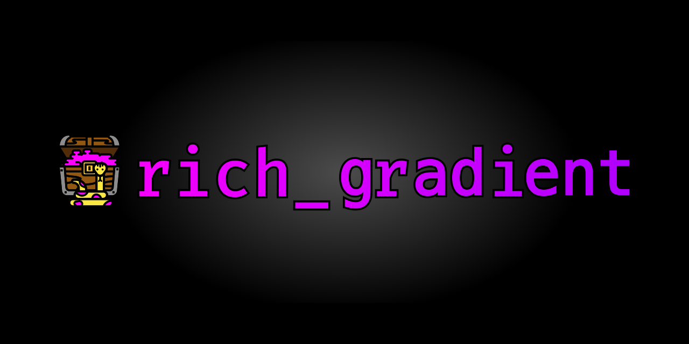
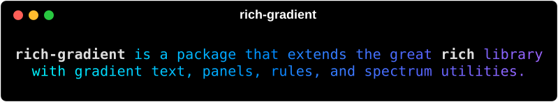

  

<h1 style='display:flex; align-items:center;>
    
    Maxwell Ludden
</h1>

I'm a PCB Layout Engineer but a giant geek. Self taught python programmer that enjoys creating automations.

Outside of work, I enjoy creating art, vector designs (like the [generalizations's image](https://github.com/maxludden/maxludden/blob/d7ac512741b6bf3cdedae99e5b5106f9f96fcc8d/Images/generalizations-responsive.svg) and my [MaxLogo](https://github.com/maxludden/maxludden/blob/d7ac512741b6bf3cdedae99e5b5106f9f96fcc8d/Images/maxlogo.svg),, socializing, and reading. I mainly program in Python, but always looking to learn something new!

Take a look at [`rich-gradient`](https://GitHub.com/maxludden/rich-gradient) and see if you like it.

    <a href="https://github.com/maxludden/maxludden" style="text-decoration:none; color:inherit;">
        <h2>Designed by Max Ludden</h2>
    </a>
     
     <a href="https://github.com/maxludden/maxludden" style="text-decoration:none; color:inherit;">
         

